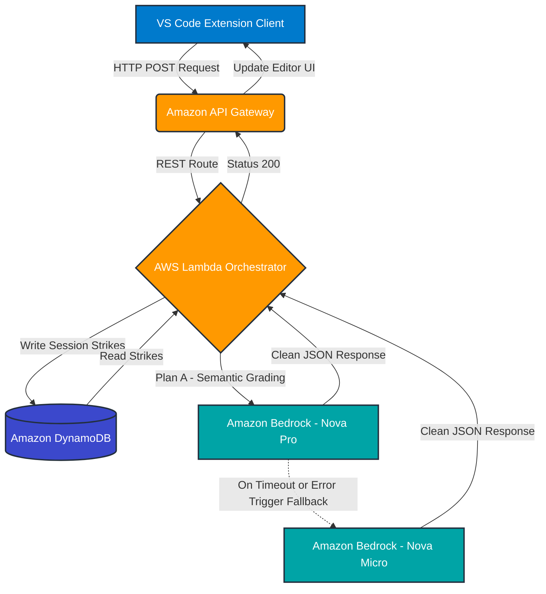

# 🛡️ Code Guardian: AI-Powered Learning for Developers

**Stop mindless copy-pasting. Learn what you build.** Code Guardian is an educational VS Code extension designed to intercept pasted, AI-generated code. Instead of allowing frictionless copying, it forces developers to explain the logic in their own words. Powered by a robust, fault-tolerant AWS serverless architecture, it semantically grades understanding and steps in as a mentor to prevent skill degradation.

---

## 🚀 The Problem & The Solution
The rise of AI code generation has created an environment where developers paste code without genuinely understanding it. 

**Code Guardian** reintroduces healthy friction:
1. **Intercept:** Captures code blocks targeted for the editor.
2. **Evaluate:** Uses Amazon Bedrock to semantically grade the developer's natural language explanation of the code.
3. **Mentor:** If the developer fails to explain the code 3 times, the system triggers **"ELI5 (Explain Like I'm 5) Mode"**, generating a real-world, jargon-free analogy to teach the core concept.

---

## ☁️ Enterprise Cloud Architecture

This project is built natively on AWS, prioritizing **High Availability (HA)**, **Least-Privilege Security**, and **Serverless Scalability**.

* **Compute:** **AWS Lambda** executes the Python backend, acting as the orchestrator between the client, database, and AI engine.
* **API Layer:** **Amazon API Gateway** provides the secure REST API endpoint connecting the local VS Code environment to the cloud.
* **Database:** **Amazon DynamoDB** (NoSQL) persistently tracks user sessions, explanation scores, and strike counts in real-time.
* **Security:** **AWS IAM** enforces strict, programmatic-only access, ensuring the Lambda function has secure, isolated permissions to Bedrock and DynamoDB.
* **AI Engine:** **Amazon Bedrock** provides the state-of-the-art Generative AI capabilities, utilizing the `bedrock.converse` API for strict JSON adherence.

---

## 🛡️ Fault-Tolerant "Fallback" System (Highlight)

In a production environment, relying on a single AI model is a single point of failure. **Code Guardian is designed with an enterprise-grade Fallback Routing System to ensure 100% uptime.**

If the primary, high-capability model experiences unexpected latency or server errors, the AWS Lambda backend instantly and silently reroutes the prompt to a secondary, highly-available backup model. The VS Code user experiences zero downtime.

* **Plan A (Primary):** `amazon.nova-pro-v1:0` — Used for deep semantic grading and nuanced ELI5 analogies.
* **Plan B (Fallback):** `amazon.nova-micro-v1:0` — A blazing-fast, lightweight model that instantly takes over if the primary model times out.

---

## 🛠️ Core Features

* **Semantic Grading:** Moves beyond simple keyword matching. The Bedrock AI understands the *intent* of the user's explanation.
* **Stateful Sessions:** DynamoDB tracks user "strikes" across their session, creating a dynamic learning loop.
* **Zero-Jargon Fallback:** The ELI5 mentor mode is strictly prompted to avoid technical jargon, ensuring absolute beginners can grasp complex algorithms using relatable analogies (e.g., cooking, cars, building blocks).

---

## 📦 Prototype Assets 

* **`/extension`**: Contains the TypeScript/Node.js source code for the VS Code client.
* **`/aws-backend`**: Contains the Python AWS Lambda function and Bedrock configuration.
* `CodeGuardian.vsix`: The compiled, ready-to-install VS Code extension.

---

## 💡 Future Roadmap

* **Clipboard API Hooking:** Automatically trigger the prompt the moment `Ctrl+V` is pressed.
* **Multilingual Mentorship:** Provide ELI5 analogies in regional Indian languages (Hindi, Tamil, etc.).
* **Gamification:** Introduce daily streaks and knowledge points stored in DynamoDB.
* **Contextual Code Optimization:** AI-driven tips on time complexity and library efficiency based on the pasted code.

---

 
*Built by Team The Sentinels for the AWS AI for Bharat Hackathon.*

